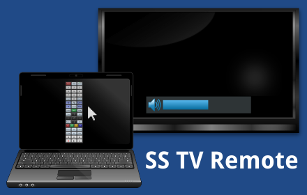

SS TV Remote (Chrome app)
=========================

 

Chrome app to control a Samsung TV over LAN/Wi-Fi. Should work on most modern Samsung TVs (those that are either plasma, LCD or LED, and were manufactured around 2010 or later) that are connected to the network. [Get it on Chrome Web Store!][cws]

[][cws]

Features
--------

* Open-source!
* Multiple button layouts: choose the one that is most suited to you!
* Flexible size: the window is resizable and the contents will adapt to any size.
* Macro support: a single button can send a sequence of key presses to the TV (e.g. raise the volume 4 times).
* Option to keep the window always on top.
* Option to display the window on all workspaces (on platforms that support it, i.e. anything but Windows).
* [Tabbing navigation][].

To-do list
----------

This is the list of planned features, but there is no schedule to when they will be implemented. In fact, there is not even a promise.

* Allow custom layouts written by the user.
    * A `textarea` where the user can input a JSON (or JSON-ish) definition of the button layout.
    * Write documentation regarding the JSON layout definition.

* Allow inline SVG data in the layout definition.
    * This will allow embedding a custom SVG inside the JSON data entered by the user.

* Split the code into two parts: the UI-handling code and the protocol-handling code.
    * This is the first step towards writing a Chrome extension.

* [I18n][], multiple languages.

* Keyboard-input mode, where keyboard keys are mapped to Samsung TV keys (e.g. using keyboard arrows to navigate menus at the TV).
    * Is this useful enough to justify the added complexity in the UI and in the code? Personally, I don't think so.

FAQ
---

**Q:** Why does it require permission to *Exchange data with any computer on the local network or internet*?

**A:** Because that's exactly what it does. See also the next questions.

**Q:** How does it work?

**A:** Most modern Samsung TV can be connected to the network. Such TVs also implement a proprietary protocol to receive commands over the network, such protocol is used by Samsung mobile apps to let the user control the TV with a mobile phone. There is no official documentation on this protocol. The implementation in this project is based on the [reverse-engineering][protocol-1] [efforts by][protocol-2] [other people][protocol-3]. Not all payloads were previously documented, and I had to do some (minor?) reverse-engineering by myself to understand what they mean; but without an official documentation it is impossible to be sure I got the meaning right. The code has been written from scratch in JavaScript.

**Q:** Why is this packaged as a Chrome app? Couldn't it run directly from a web page in the browser?

**A:** The protocol to communicate with Samsung TVs is proprietary, the remote control application must have access to a TCP socket to implement such protocol. A web page is restricted to HTTP requests, there is no support for sockets with arbitrary protocols. The so-called [WebSockets][websocket] are not a real socket: they have a specific protocol that is based on HTTP.

**Q:** Why is it a Chrome app instead of a Chrome extension?

**A:** Because [Chrome apps][chrome-apps] have access to [additional APIs][chrome-apps-apis] (such as [`chrome.sockets.tcp`][chrome-sockets-tcp]) that [are not available to Chrome extensions][chrome-extension-apis].

**Q:** But I want an icon on the Chrome toolbar!

**A:** Chrome includes [APIs to let extensions/apps communicate with each other][chrome-messaging-external]. Thus, it should be possible to write a Chrome extension that handles the user interaction (i.e. shows the buttons to the user), but ends up calling a Chrome app to handle the protocol in the background. This split architecture (app + extension) requires more code to be written, as well as refactoring the current code. This is why it is not implemented (yet).

**Q:** Why can't this remote control automatically detect the IP address of the TV?

**A:** Because such feature is not implemented (yet). It will require studying how to implement it, and probably will require either implementing [UPnP][] or doing a network scan. And, of course, also building the user interface for such feature.

**Q:** This remote control was working before, but now it is not working anymore!

**A:** Check if the IP address of your TV has changed. You may want to set a fixed IP address for your TV (you can configure it at your router).

**Q:** I don't like the existing button layouts, can I make one?

**A:** For now, if you make a new layout, you have and submit it to this project and I have to deploy it to everyone. In the future, I want to allow custom layouts written by the user.

**Q:** Why is the window rectangular? I wish it had rounded corners. Or that it had the exact shape of the SVG drawing of the layout.

**A:** Because [Chrome does not allow transparent windows][transparent-window].

Credits
-------

The packaged app includes public domain drawings by [FrancescoPallucchini][oc-option] and [AshKyd][oc-remote].

Promotional images include public domain clipart by [hellocatfood][oc-mouse], [Keistutis][oc-laptop], [Ehecatl1138][oc-tv], [mightyman][oc-volume].

The options window uses http://purecss.io/ as the base CSS.

[cws]: TODO! GET LINK!
[websocket]: https://en.wikipedia.org/wiki/WebSocket
[chrome-apps]: https://developer.chrome.com/apps/about_apps
[chrome-sockets-tcp]: https://developer.chrome.com/apps/sockets_tcp
[chrome-apps-apis]: https://developer.chrome.com/apps/api_index
[chrome-extension-apis]: https://developer.chrome.com/extensions/api_index
[chrome-messaging-external]: https://developer.chrome.com/extensions/messaging#external
[upnp]: https://en.wikipedia.org/wiki/Universal_Plug_and_Play
[tabbing navigation]: https://en.wikipedia.org/wiki/Tabbing_navigation
[i18n]: https://developer.chrome.com/apps/i18n
[transparent-window]: https://stackoverflow.com/questions/27804315/
[protocol-1]: http://sc0ty.pl/2012/02/samsung-tv-network-remote-control-protocol/
[protocol-2]: http://deneb.homedns.org/things/?p=232
[protocol-3]: http://forum.samygo.tv/viewtopic.php?f=12&t=1792
[oc-option]: https://openclipart.org/detail/193351/option-button-symbol
[oc-remote]: https://openclipart.org/detail/27349/remote-control-by-ashkyd-27349
[oc-mouse]: https://openclipart.org/detail/166356/mouse-cursor-arrow
[oc-laptop]: https://openclipart.org/detail/168489/pc-laptop-notebook
[oc-tv]: https://openclipart.org/detail/170186/lcd-led-plasma-tv-tv-de-plasma-led-lcd
[oc-volume]: https://openclipart.org/detail/166028/volume-level-3
